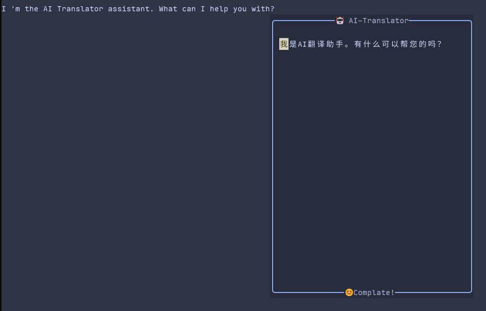

# AI Translator

[中文版](https://github.com/HusuSama/ai-translator/blob/main/README_CN.md)

A simple plugin that uses `AI` to help you translate quickly and conveniently.

## Screenshots



## Installation

You can install it using any method you prefer. Here's an example using [lazy.nvim](https://github.com/folke/lazy.nvim):

```lua
{
  "HusuSama/ai-translator",
  config = function()
    vim.keymap.set({ "n", "v" }, "<leader>Tw", require("ai-translator").trans, { noremap = true })
    require("ai-translator").setup {
    -- target language for translations
    language = "Chinese",
      model = {
        api_key = "xxx",
      },
    }
  end,
  dependencies = {
    "nvim-lua/plenary.nvim",
    "MunifTanjim/nui.nvim",
    "MeanderingProgrammer/render-markdown.nvim",
  },
}
```

> [!important]
> Uses deepseek for translation by default. You can modify this, but other models haven't been adapted yet and may not work.

```lua
{
  "HusuSama/ai-translator",
  config = function()
    vim.keymap.set({ "n", "v" }, "<leader>Tw", require("ai-translator").trans, { noremap = true })
    -- target language for translations
    language = "Chinese",
    require("ai-translator").setup {
      model = {
        model_name = "deepseek-chat",
        base_url = "https://api.deepseek.com/chat/completions"
        -- Set api_key 
        api_key = "xxx",
        -- You can also set api_key via environment variables (name defined here)
        env_key = "API_KEY"
      },
    }
  end,
  dependencies = {
    "nvim-lua/plenary.nvim",
    "MunifTanjim/nui.nvim",
    "MeanderingProgrammer/render-markdown.nvim",
  },
}
```

> [!important]
> The plugin doesn't set any keymaps automatically – you need to configure your preferred keybindings.

default config

```lua
---@class ai-translator.Config
{
    ---@alias ai-translator.Language string
    -- target language for translations
    language = "Chinese",
    ---@alias ai-translator.ProviderName "openai" | string
    provider = "openai",
    -- If the api_key is not set, the environment variable API_KEY will be used. You can change it by configuring env_key.
    ---@alias ai-translator.ModelOpts {base_url: string, api_key?: string, env_key: string, model_name: string}
    model = {
        base_url = "https://api.deepseek.com/chat/completions",
        model_name = "deepseek-chat",
        env_key = "API_KEY",
    },
    ---@alias ai-translator.UIOptions {width: number, height: number, relative: string, position: table}
    ui = {
        width = 40,
        height = 20,
        relative = "cursor",
        position = { row = 3, col = 2 },
    },
    thinking_icons = { "🤯", "😶‍🌫️", "🤔", "🧠", "💭" },
}
```

## Usage
Use the configured keybinding or call require("ai-translator").trans() to perform translations.
