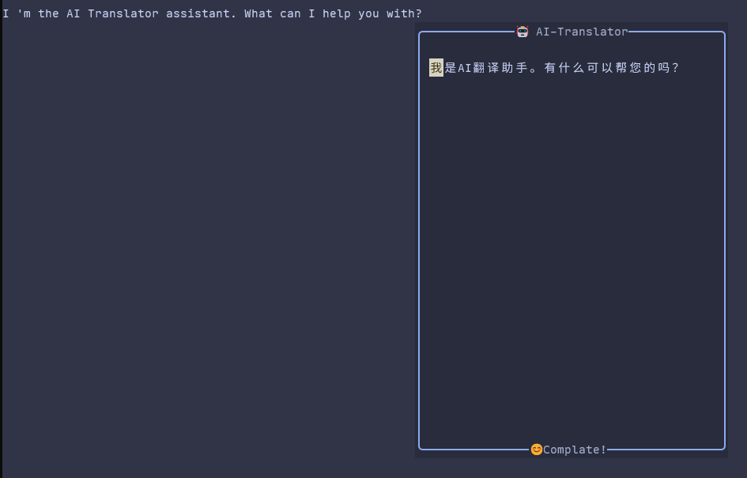

# AI Translator

一个简单的插件，利用 `AI` 帮你快捷进行翻译

## 截图



## 安装

你可以使用任何你喜欢的方式进行安装，这里演示如何使用 [lazy.nvim](https://github.com/folke/lazy.nvim) 进行安装

```lua
{
  "HusuSama/ai-translator",
  config = {
    config = function()
      vim.keymap.set({ "n", "v" }, "<leader>Tw", require("ai-translator").trans, { noremap = true })
      require("ai-translator").setup {
        -- target language for translations
        language = "Chinese",
        model = {
          api_key = "xxx",
        },
      }
    end,
    dependencies = {
      "nvim-lua/plenary.nvim",
      "MunifTanjim/nui.nvim",
      "MeanderingProgrammer/render-markdown.nvim",
    },
  }
}
```

> [!important]
> 默认使用 `deepseek` 进行翻译，你可以修改其他，但目前并没有进行适配操作，不一定能使用

```lua
{
  "HusuSama/ai-translator",
  config = {
    config = function()
      vim.keymap.set({ "n", "v" }, "<leader>Tw", require("ai-translator").trans, { noremap = true })
      require("ai-translator").setup {
        -- target language for translations
        language = "Chinese",
        model = {
          model_name = "deepseek-chat",
          base_url = "https://api.deepseek.com/chat/completions"
          -- 设置 api_key 
          api_key = "xxx",
          -- 你也可以通过环境变量的方式来设置 api_key，这里定义了环境变量名称
          env_key = "API_KEY"
        },
      }
    end,
    dependencies = {
      "nvim-lua/plenary.nvim",
      "MunifTanjim/nui.nvim",
      "MeanderingProgrammer/render-markdown.nvim",
    },
  }
}
```

> [!importtant]
> 插件不会主动设置任何映射，你需要自己设置你喜欢的按键


默认配置

```lua
---@class ai-translator.Config
{
    ---@alias ai-translator.Language string
    -- target language for translations
    language = "Chinese",
    ---@alias ai-translator.ProviderName "openai" | string
    provider = "openai",
    -- If the api_key is not set, the environment variable API_KEY will be used. You can change it by configuring env_key.
    ---@alias ai-translator.ModelOpts {base_url: string, api_key?: string, env_key: string, model_name: string}
    model = {
        base_url = "https://api.deepseek.com/chat/completions",
        model_name = "deepseek-chat",
        env_key = "API_KEY",
    },
    ---@alias ai-translator.UIOptions {width: number, height: number, relative: string, position: table}
    ui = {
        width = 40,
        height = 20,
        relative = "cursor",
        position = { row = 3, col = 2 },
    },
    thinking_icons = { "🤯", "😶‍🌫️", "🤔", "🧠", "💭" },
}
```

## 使用

你可以通过快捷键或者调用命令 `require("ai-translator").trans()` 来进行翻译操作


